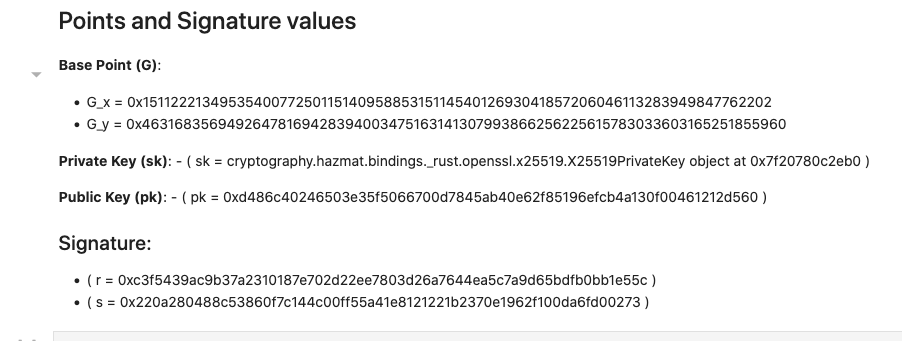

# Edwards Curve Digital Signature Algorithm with X25519
This is an implementation of the Edwards Curve Digital Signature Algorithm with X25519. The implementation uses the sagemath libraries for the elliptic curve operations. The implementation is in Jupyter Notebook format for simplicity.

# Helper functions
Various helper functions are defined in the notebook to perform the following operations:
Integer to bytes, Integer from bytes. Also in some of the code using the built in .to_bytes, .from_bytes functions. point_add() function is defined to perform the point addition operation. point_mult() function is defined to perform the point multiplication operation. recover_x() function to recover the x coordinate from the y coordinate.

# Point Addition
Using sagemath, the point addition operation is implemented as a function. The function takes in two points and returns the sum of the two points.

# Base Points
The base points for the X25519 curve are defined as Gx, Gy and the base point is defined as G.

# Key Generation
This notebook uses the cryptography library for generating the public and private keys. The keys are generated using the X25519 curve.

# Signature
The signature is generated using the private key and the message. The signature is then verified using the public key and the message.

# Expected output

